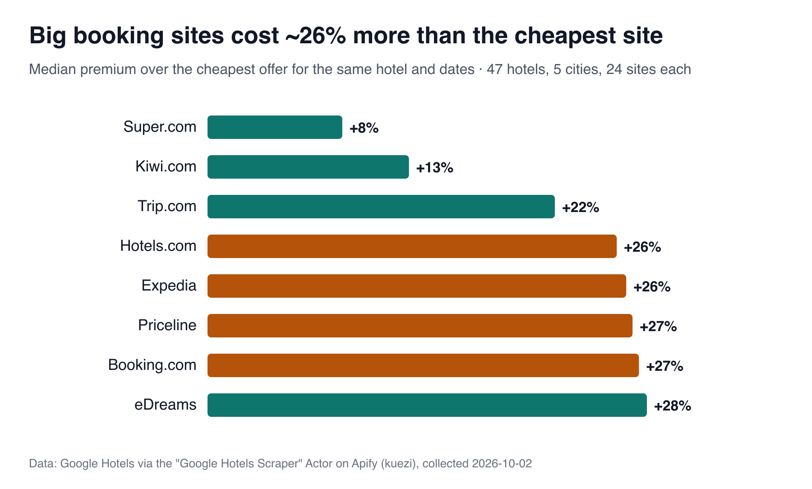
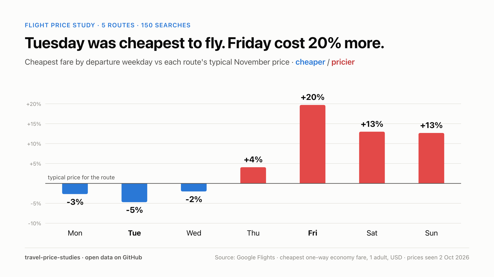
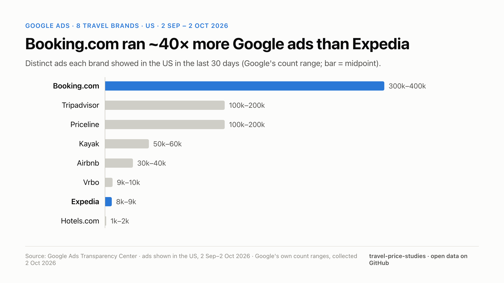

# Travel price studies (open data)

Small, reproducible studies of what travellers actually pay, collected from Google Hotels and Google Flights.
Everything here can be re-run with `python3 analysis.py`. **Data: CC BY 4.0. Code: MIT.**

## 1. Which booking site is cheapest? (collected 2 Oct 2026)

- **What:** 47 hotels (the top 10 Google Hotels results in Paris, London, New York, Barcelona and Bangkok), compared on 24.4 booking sites per hotel on average.
- **Stay:** 12–15 Nov 2026, 3 nights, 2 adults, USD, US point of sale.
- **Result: big brands cost a median 26–27% more than the cheapest site for the same hotel and dates.** Booking.com +27.2%, Priceline +26.8%, Expedia +26.4%, Hotels.com +25.8%.
- The cheapest offer most often came from smaller sites: Super.com, Vio.com and Traveluro (9 hotels each).
- **Expedia, Hotels.com, Orbitz, Travelocity and CheapTickets showed the identical price on 37 of 45 hotels.**
- The hotel's own website was cheapest on only 4 of the 34 hotels where it could be identified by name.
- The median spread between the cheapest and the priciest site for the same room was 67%: New York 41%, Paris 62%, Barcelona 67%, London 98%, Bangkok 116%.
- Google's headline price matched the cheapest site on 42 of 47 hotels.

**Caveats:**
- These are listed prices; nothing was booked.
- Smaller sites can have stricter cancellation terms, member-only rates or fees added at checkout.
- One stay window, one collection day.

Data: [`data/hotels-booking-site-prices-2026-10-02.csv`](data/hotels-booking-site-prices-2026-10-02.csv), one row per hotel × site.

## 2. What's the cheapest day to fly? (prices seen 2 Oct 2026)

- **What:** the cheapest one-way economy fare for every departure day in November 2026 (1 adult, USD, US point of sale) on 5 routes: JFK→LAX, LHR→JFK, ORD→MIA, SFO→HNL and LAX→NRT. That's 150 searches.
- **Result: Tuesday −4.7%, Monday −2.7%, Wednesday −2.0%, Thursday +4.1%, Friday +19.7%, Saturday +13.0%, Sunday +12.7%** vs each route's November median.
- Wrong day vs right day: SFO→HNL $163 vs $444 (+172%); JFK→LAX $184 vs $489 (+166%).
- The Sunday after Thanksgiving (29 Nov) was the priciest day of the month on JFK→LAX and ORD→MIA.
- Google labelled LHR→JFK prices "low" on 21 of 30 days.
- **Robustness check (suggested by a reader):** dropping the Thanksgiving window and using **1–19 Nov only** gives Mon −5.2%, Tue −2.8%, Wed +2.1%, Thu +10.2%, **Fri +13.9%**, Sat +7.6%, Sun +5.2%.
  - The holiday inflates the headline: Friday falls from +19.7% and Sunday from +12.7%.
  - Monday edges out Tuesday as the cheapest day.
  - Friday is still the priciest, but on only 2 Fridays × 5 routes.

**Caveats:** 5 routes, one month that includes US Thanksgiving, prices seen on one day.

Data: [`data/flights-cheapest-fare-by-day-2026-10-02.csv`](data/flights-cheapest-fare-by-day-2026-10-02.csv), one row per route × day, with Google's price level and typical range.

## 3. How do the big travel brands advertise on Google? (collected 2 Oct 2026)

- **What:** Google Ads Transparency Center counts for 8 travel websites. Ads shown in the US from 2 Sep to 2 Oct 2026, broken down by platform and format, plus the first 400 ads Google lists for each brand.
- **Result: Booking.com showed ~300k–400k distinct ads, about 40× Expedia (8k–9k).** Tripadvisor and Priceline were at 100k–200k each, Kayak 50k–60k, Airbnb 30k–40k, Vrbo 9k–10k and Hotels.com 1k–2k.
- **Formats:** Booking.com is almost entirely text (Search) ads: **29 video ads**, against Expedia's **2k–3k**. Priceline showed no video ads.
- **Google Maps:** Booking.com 20k–30k ads, Priceline 8k–9k, Tripadvisor 4k–5k, Kayak 0.
- **Shopping and Play:** 25 Shopping ads or fewer per brand, and 0 Google Play ads.
- **New creative:** among the first 400 ads Google lists for each brand, the number first shown in the last 30 days was Vrbo 84, Hotels.com 71, Expedia 58, Priceline 21, Airbnb 4, Booking.com 1, Tripadvisor 1 and Kayak 0.
- **Files:**
  - `data/google-ads-travel-brands-us-2026-10-02.csv`: Google's count ranges per brand × platform/format.
  - `data/google-ads-travel-brands-us-sample-2026-10-02.csv`: 3,200 ad records with advertiser, ad ID, format, first and last shown, and a link.

**Caveats:**
- Counts are Google's own **ranges** of distinct ad creatives, not impressions or spend.
- "YouTube" as a platform includes text ads shown in YouTube search.
- The 400-ad samples follow Google's listing order, so they are not random.

## How the data was collected
*Disclosure: I built both tools.*
- Hotels: [Google Hotels Scraper on Apify](https://apify.com/kuezi/google-hotels-scraper), with `includeVendorPrices: true`.
- Flights: [Google Flights Scraper on Apify](https://apify.com/kuezi/google-flights-scraper), with a `scanDepartureUntil` date range.
- Ads: [Google Ads Transparency Scraper on Apify](https://apify.com/kuezi/google-ads-transparency-scraper), with `country: US`, `lastDays: 30` and per-platform/format filters.
- Trend data for future studies: [Google Trends Scraper on Apify](https://apify.com/kuezi/google-trends-scraper).

Booking links were removed from the public data because they contain ad-tracking parameters.

## Cite
> Travel price studies (2026). Booking-site premiums and cheapest departure days, collected from Google Hotels and Google Flights. https://github.com/ISHEMAH/travel-price-studies (CC BY 4.0)
